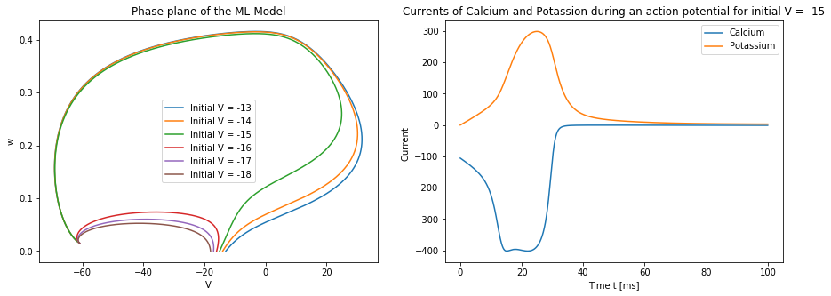

# A simulation of the changes in neural membrane potentials
In this project, we tried to analyze the behaviour of a simulated membrane with changes in the potential over it and in different parameters. Specifically, we wanted to determine the stationary points of different neural membrane systems and evaluate, if and how the systems reach these steady states. In the process of this, we also simulated the induction of an action potential as well as oscillations in our system. 

# A minimalized system of the model by Hodgkin and Huxley
Fitzhugh derived a model for the change in potential and in fraction of open ion channels in the membrane:

```math
\frac{dV}{dt} = V(a-V)(V-1)-W \\
\frac{dW}{dt} = b(V-W)
```

By setting the derivations to zero, we can find the nullclines of the ODE in the respective phase plane. Both equations were rewritten to define w in dependency of V:

```math
W = V(a-V)(V-1) \\
W = V
```

We can then additionally integrate over the ODEs to find the trajectories of the system for different starting parameters. In the following image, this was done for $`a=0.25`$ and $`b=1`$:


This model can not produce an action potential and periodic firing, as all trajectories are leading to the same steady state in $`(0,0)`$. There is no stable cycle to oscillate over.

# The Morris-Lecar model as an oscillating system
A more detailed model than the one inspected above is the Morris-Lecar (ML) model. 

```math
\frac{dV}{dt} = \frac{-g_{Ca}m_{inf}(V)(V-V_{Ca})-g_KW(V-V_K)-g_L(V-V_L)}{C_m} \\
\frac{dW}{dt} = \phi\frac{W_{inf}(V)-W}{\tau(V)}
```

In this system, action potentials and oscillations can actually be induced with the right parameters. We integrated over the ODEs with different initial values for V and W=0 and plotted the trajectories of the system in its phase plane. From this, we determined, that the system produces an action potential for $`V>=-15`$. We then plotted the Calcium and Potassium currents through the membrane during the action potential for $`V=-15`$. The currents of calcium $`I_{Ca}`$ and potassium $`I_K`$ are simply the respective elements in the ODE:

```math
I_{Ca} = g_{Ca}m_{inf}(V)(V-V_{Ca}) \\
I_K = g_KW(V-V_K)
```



Next, we can investigate the system's ability to oscillate. By adding a fourth constant current $`I_0`$ to the entire current, we can simulate a constant current over the membrane, independent of the considered ions. Analyzing a range of values for $`I_0`$ yielded the interval $`~90<I<~210`$ for that value, where the system oscillates:


If some parameters of the system are changed, we can design a model containing a stable cycle as well as a stationary point. In such a model, it is possible to enter the stable cycle and exit it through a sudden impulse, ending in a stationary point. $`I_0`$ was set to 110. After about a third of the entire time interval, an impulse of 140 Mikroampere was applied for 1000 time steps. This was enough to terminate the oscillations and enter the drawing-in radius of the stationary point. 


Lastly, we also succeeded in drawing a rough graph of the frequency of oscillations of the system in dependency of the constant current:

